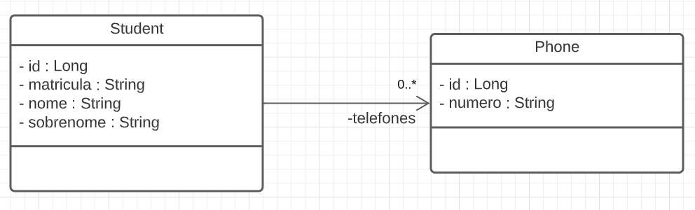

# 👨‍💻Student API

A api foi desenvolvida com o intuito de exercitar meus conhecimentos em Java e Spring Boot.

O projeto trata-se de um CRUD, onde é possível criar, consultar, atualizar e excluir estudantes.

## 🗺️Diagrama de Classes 



## ⚠️Regras de Negócio

- Os campos de matrícula, nome e sobrenome são obrigatórios e devem ter mais de 3 caracteres;
- O campo de matrícula não pode se repetir na base de dados;
- No momento do cadastro do estudante, é possível também registrar telefones. Caso um telefone seja registrado, seu número não pode ser nulo e deve conter pelo menos um carácter.

## 🎯Endpoints

### 👨‍🎓Estudantes

- `/estudantes` - GET -- Exibe todos os estudantes cadastrados.
- `/estudantes/{matricula}` - GET -- Exibe um estudante em específico.
- `/estudantes` - POST -- Cria um estudante.
- `/estudantes/{matricula}` - PUT -- Atualiza os dados (matrícula, nome e sobrenome) de um estudante em específico.
- `/estudantes/{matricula}` - DELETE -- Exclui um estudante em específico.

### Exemplo de JSON para criar um estudante sem telefone(s)

``` json
{
    "matricula": "123-A",
    "nome": "Luciana",
    "sobrenome": "Santos"
}
```

### Exemplo de JSON para criar um estudante com telefone(s)

``` json
{
    "matricula": "123-A",
    "nome": "Luciana",
    "sobrenome": "Santos",
    "telefones" : [
        {
            "numero" : "4002-8922"
        },
        {
            "numero" : "8922-4002"
        }
    ]
}
```

### Exemplo de JSON para atualizar estudante
``` json
{
    "matricula": "123-A - updated",
    "nome": "Luciana - updated",
    "sobrenome": "Santos - updated"
}
```

## 🧰Ferramentas Utilizadas

1. Java 17
2. Spring Boot
3. Spring Web
4. Spring Data JPA
5. Spring Validation
6. H2 Database
7. Lombok
8. Model Mapper
9. Intellij

